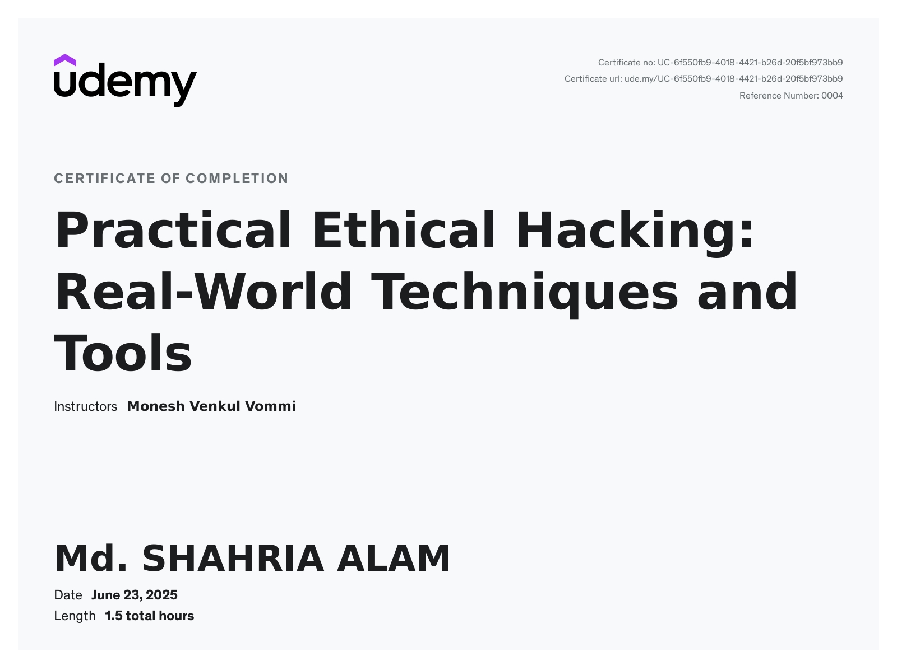

# Hi there, I'm Md. Shahria Alam 👋

## 🛡️ Cybersecurity Professional & Ethical Hacker

Welcome to my GitHub profile! I'm a passionate cybersecurity enthusiast specializing in ethical hacking and penetration testing. I believe in making the digital world safer through responsible security practices.

### 🎯 About Me

- 🔐 **Certified Ethical Hacker** with expertise in real-world security techniques
- 🎓 Recently completed **Practical Ethical Hacking: Real-World Techniques and Tools** certification
- 💻 Focused on vulnerability assessment, penetration testing, and security research
- 🌱 Continuously learning and staying updated with the latest cybersecurity trends
- 📍 Based in Chittagong, Bangladesh

### 🏆 Certifications

- **Practical Ethical Hacking: Real-World Techniques and Tools** (June 2025)
  - Instructor: Monesh Venkul Vommi
  - Duration: 1.5 hours intensive training
  - Platform: Udemy
  - Certificate ID: UC-6f50fb9-40f8-4421-b26d-20fb9f73cb9

### 🔧 Technical Skills

#### Security Testing & Assessment
- Vulnerability Assessment
- Penetration Testing
- Network Security Analysis
- Web Application Security Testing
- Social Engineering Awareness

#### Tools & Technologies
- Network Scanning Tools
- Vulnerability Scanners
- Exploitation Frameworks
- Security Information and Event Management (SIEM)
- Incident Response Tools

#### Programming & Scripting
- Python (Security Automation)
- Bash Scripting
- PowerShell
- SQL (Security Testing)

### 🎯 Areas of Interest

- **Ethical Hacking & Penetration Testing**
- **Vulnerability Research**
- **Incident Response**
- **Security Awareness Training**
- **Secure Code Review**
- **Compliance & Risk Assessment**

### 🚀 Current Projects

I'm currently working on various cybersecurity projects including:
- Security assessment tools and scripts
- Vulnerability research and documentation
- Educational content for ethical hacking
- Open-source security utilities

### 🌐 Professional Philosophy

> "Security is not a product, but a process. It's about understanding the mindset of attackers to better defend against them - ethically and responsibly."

I am committed to:
- ✅ **Responsible Disclosure** of vulnerabilities
- ✅ **Ethical Hacking Practices** only
- ✅ **Continuous Learning** and knowledge sharing
- ✅ **Community Contribution** to cybersecurity awareness

## Course Certificate

### 📫 Let's Connect

- **Email**: [mdshahriaalam2@gmail.com](mailto:mdshahriaalam2@gmail.com)

### 🤝 Collaboration

I'm always open to collaborating on:
- Cybersecurity research projects
- Open-source security tools
- Educational content creation
- Bug bounty programs
- Security awareness initiatives

### ⚖️ Ethical Guidelines

All my work follows strict ethical guidelines:
- Only testing on systems I own or have explicit permission to test
- Responsible disclosure of any vulnerabilities found
- Educational purposes only
- Compliance with all applicable laws and regulations

---

---

*Last updated: June 2025*
